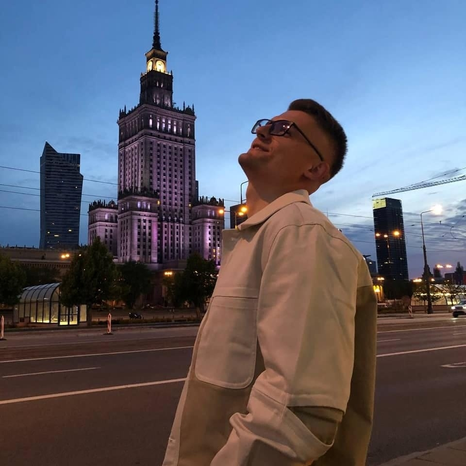

---

---
# Andrei Smolka

---
## Contacts
  * Telephone: +375-44-551-25-14
  * E-mail: deadheartedfo@gmail.com
  * GitHub: [Miarur](https://github.com/Miarur)
  * Telegram: [andr_sm](https://t.me/andr_sm)  
  * Discord: Andrei Smolka(@miarur)

---

## About myself

---------------
 I am an interesting, energetic, positive, communicative, responsible, and creative guy. I know the basics of HTML, CSS, and Java Script. In my free time, I read popular scientific books, go to the swimming pool, and hope to learn how to play the guitar.Capable of working independently and as a good "team player."For five years, I was the sales manager, and for one year, I had a small project in Poland.But I realized that this one was not for me. Why did I decide to be a programmer? because this speciality is closer to me.

---------------

## Skills

    - HTML 
    - CSS 
    - Java Script basics
    - C# basics
    - Python basics
    - Soft skills
    
---------------
